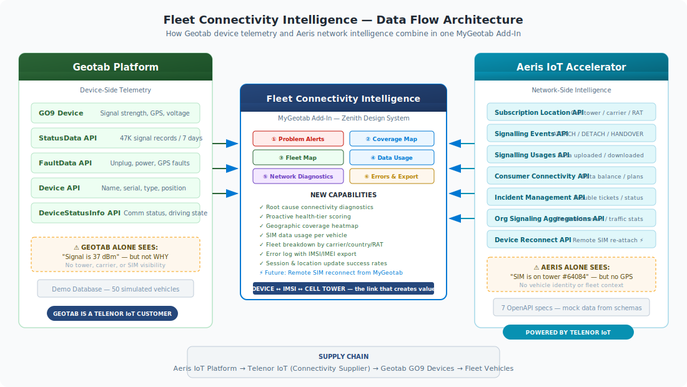

# Fleet Connectivity Intelligence

**A MyGeotab Add-In that bridges device telemetry and cellular network intelligence — built for the [Geotab Vibe Coding Challenge 2026](https://luma.com/h6ldbaxp).**

> **The Problem:** Geotab tells fleet managers *that* a vehicle has weak signal. But it can't tell them *why*. Is it the tower? The SIM? The carrier? A network outage? Today, that answer lives in a completely separate platform that fleet managers never see.
>
> **The Solution:** Fleet Connectivity Intelligence correlates Geotab device data with Aeris IoT Accelerator network intelligence to give fleet managers root-cause connectivity diagnostics — all inside MyGeotab, where they already work.



---

## Why This Exists

I work as a cellular connectivity supplier through **Telenor IoT**. Geotab is one of our customers — their GO9 telematics devices connect to cellular networks through SIM cards that we provision and manage on the Aeris platform.

Every day, I see both sides of the connectivity story:

- **Inside MyGeotab**, fleet managers see a signal strength number (e.g., 37 dBm) and device fault codes — but they have no idea which cell tower is serving the vehicle, what carrier is active, or whether the SIM is about to run out of data.

- **Inside the Aeris/Telenor IoT portal**, I see cell tower identities, network signaling events, data consumption, error logs, and incident tickets — but I have no GPS coordinates, no vehicle names, and no fleet context.

**Neither platform alone can answer the question: "Why is Demo-31 dropping data?"**

This Add-In brings both perspectives together for the first time.

---

## What It Does

Fleet Connectivity Intelligence is a **single self-contained HTML file** installed as a new page inside MyGeotab. It provides **8 tabs** of combined intelligence:

### Tab 1: Problem Alerts
Vehicles scored into health tiers (Critical / Warning / Minor / Healthy) based on combined Geotab + Aeris data. Each alert card shows signal strength, radio technology (LTE/3G/2G), connection drops, uptime, error codes, active incidents, and a full network event log — all on one card.

### Tab 2: Coverage Heatmap
GPS coordinates from Geotab overlaid with signal strength and cell tower locations from Aeris. Shows dead zones, 3G fallback areas, and tower quality — a map that neither platform can produce alone.

### Tab 3: Fleet Map
All 50 vehicles with dual-ring markers showing health tier and radio technology. Click any vehicle for full connectivity details including IMSI, IMEI, carrier, cell ID, and data usage.

### Tab 4: 🌐 3D Command Center
An interactive 3D globe view of the fleet powered by **Mapbox GL JS**. Vehicles appear as extruded 3D columns where height represents signal strength and color represents health tier. Critical vehicles glow red. Features include:
- **Quick-fly navigation buttons** to jump to critical clusters (Vigo), warning areas (Valencia), minor issues (Galicia), and healthy zones (NOS Portugal)
- Hover tooltips with vehicle name, tier, signal, and carrier
- Click-to-fly detail panels showing full IMSI/IMEI, error types, uptime, and data usage
- Fleet intelligence stats overlay with real-time tier counts and LTE coverage percentage
- Auto-rotation with star field atmosphere for visual impact
- *Concept prototyped in Google Firebase Studio, then integrated into the main Add-In with Claude*

### Tab 5: Data Usage
SIM data consumption per vehicle with downloaded/uploaded split, balance percentage, and usage bars. Flags vehicles approaching their data cap.

### Tab 6: Network Diagnostics
*(Mirrors the Telenor IoT real-time diagnostics view)*
Fleet-wide session setup success rate, location update success rate, error counts, and active subscription count. Includes sub-tabs for breakdowns by **Carrier**, **Country**, and **Radio Technology** — each with per-group CSV export.

### Tab 7: Errors & Export
Detailed error log with plain-English descriptions of each error type (AUTH_FAILURE, PDP_REJECT, ATTACH_REJECT, GPRS_DETACH, etc.). Three export buttons to download IMSI/IMEI lists as CSV for support escalation or Aeris portal lookup.

### Tab 8: 💬 Connectivity Assistant
A conversational chatbot interface where users can query fleet connectivity using natural language. Ask questions like:
- `show critical vehicles` — vehicles needing urgent attention
- `Demo-31` — look up a specific vehicle by name
- `Spain` or `Portugal` — filter by country
- `Orange ES` or `Vodafone PT` — filter by carrier
- `214010000000031` — look up by IMSI
- `35684900003145` — look up by IMEI
- `GSM` / `2G` / `WCDMA` / `3G` / `LTE` / `4G` — filter by radio technology
- `fleet summary` — overall fleet health statistics
- `how many errors` — error count and breakdown by type

*Built using the **Geotab Add-In Architect Gem** (Google Gemini), then enhanced and integrated into the main Add-In with Claude.*

---

## The Data Sources

This Add-In combines data from two ecosystems:

**From Geotab (MyGeotab API):**
- Device names, IDs, and vehicle metadata
- GPS coordinates (latitude/longitude) for vehicle positions
- StatusData for signal strength readings
- FaultData for device diagnostic codes
- DeviceStatusInfo for online/offline status

**From Aeris IoT Accelerator (7 REST APIs):**
- **Subscription Location API** — Cell tower identity (MCC/MNC/LAC/Cell ID), radio technology (LTE/WCDMA/GSM)
- **Consumer Connectivity API** — SIM data usage (upload/download), plan limits, balance
- **Device Reconnect API** — PDP context success/failure rates, attach/detach events
- **Incident Management API** — Open tickets, severity, affected subscriptions
- **Organization Signaling API** — Fleet-wide KPIs (session success rate, location update rate)
- **Subscription Signaling Usage API** — Per-SIM signaling event counts
- **Subscription Signaling Events API** — Detailed error logs (AUTH_FAILURE, PDP_REJECT, etc.)

The 7 OpenAPI specification files in `api-specs/` are the actual API contracts from the Aeris platform.

---

## About the Demo Data

This Add-In uses **realistic mock data** for the contest demonstration. The Geotab side runs against a standard Geotab demo database (`Demo_Tim_Vibe_DB` with 50 vehicles). The Aeris side uses mock data generated from the actual OpenAPI specifications.

This was a deliberate choice to avoid exposing live customer data while demonstrating the full capability of the integrated solution. The mock data includes:
- **50 vehicles** across Spain and Portugal
- **4 health tiers**: 60% healthy, 10% minor, 10% warning, 10% critical
- **3 carriers**: Orange ES, Vodafone PT, NOS PT
- **3 radio technologies**: LTE (majority), WCDMA, GSM
- **Realistic error distributions**: Critical vehicles have 16-40 errors with AUTH_FAILURE, GPRS_DETACH; healthy vehicles have 0-1 minor errors

The mock data generation script is included at [`mock-data/generate_mock_data.py`](mock-data/generate_mock_data.py) for full transparency.

---

## Installation

### MyGeotab Add-In Configuration

```json
{
  "name": "Fleet Connectivity Intelligence",
  "supportEmail": "timothy.batzel@telenorconnexion.com",
  "version": "5.0.0",
  "items": [
    {
      "url": "fleet_connectivity_v5.html",
      "path": "ActivityLink/",
      "menuName": { "en": "Connectivity Intelligence" }
    }
  ],
  "isSigned": false
}
```

### Steps to Install

1. Log into your MyGeotab database
2. Navigate to **Administration → System → System Settings → Add-Ins**
3. Click **+ New Add-In**
4. In the **Configuration** tab, paste the JSON above
5. In the **Files** tab, upload `fleet_connectivity_v5.html`
6. Click **Done** → **Save** → Refresh the page
7. "Connectivity Intelligence" appears in the left sidebar

### Standalone Testing

You can also double-click `fleet_connectivity_v5.html` in any web browser to test it outside MyGeotab. All tabs work in standalone mode.

---

## Technical Details

- **Architecture**: Single self-contained HTML file — all CSS, JavaScript, and mock data are inline. No build tools, no npm, no webpack required.
- **Styling**: Geotab's official [Zenith Design System](https://zenith.geotab.com/) CSS variables and tokens.
- **2D Mapping**: [Leaflet.js](https://leafletjs.com/) v1.9.4 with OpenStreetMap tiles.
- **3D Mapping**: [Mapbox GL JS](https://docs.mapbox.com/mapbox-gl-js/) v3.4.0 with dark globe theme, 3D extrusions, and atmospheric fog.
- **Export**: Client-side CSV generation using `Blob` and `URL.createObjectURL`.
- **MyGeotab Integration**: `geotab.addin` lifecycle registration with `initialize`, `focus`, and `blur` callbacks plus `DOMContentLoaded` and `window.load` fallbacks for standalone mode.

---

## Repository Structure

```
fleet-connectivity-intelligence/
├── fleet_connectivity_v5.html          # Main Add-In (v5 — 8 tabs, self-contained)
├── addin_config_v5.json                # MyGeotab Add-In configuration for v5
├── fleet_connectivity_v4.html          # Previous version (7 tabs, no 3D map)
├── addin_config_v4.json                # v4 configuration
├── fleet_connectivity_v3.html          # Earlier version (6 tabs)
├── addin_config_v3.json                # v3 configuration
├── connectivity_assistant.html         # Standalone chatbot (Google Gem output)
├── addin_config_assistant.json         # Standalone chatbot config
├── fci-command-center.js               # Firebase Studio 3D prototype (reference only)
├── fci-command-center.css              # Firebase Studio 3D styles (reference only)
├── architecture.svg                    # Data flow diagram
├── PROMPT_JOURNAL.md                   # Full AI development process log
├── README.md                           # This file
├── LICENSE                             # Apache 2.0
├── api-specs/                          # Aeris IoT Accelerator OpenAPI specs
│   ├── consumer-connectivity-api.yaml
│   ├── device-reconnect-api.yaml
│   ├── incident-management-api.yaml
│   ├── organization-signaling-api.yaml
│   ├── subscription-location-api.yaml
│   ├── subscription-signalling-events-api.yaml
│   └── subscription-signalling-usage-api.yaml
└── mock-data/
    └── generate_mock_data.py           # Mock data generation script (400+ lines)
```

### Version History

| Version | Tabs | What Changed |
|---------|------|-------------|
| v3 | 6 | Core dashboard: Alerts, Coverage Map, Fleet Map, Data Usage, Network Diagnostics, Errors & Export |
| v4 | 7 | Added 💬 Connectivity Assistant chatbot (built with Geotab Add-In Architect Gem) |
| v5 | 8 | Added 🌐 3D Command Center (prototyped in Firebase Studio, integrated with Claude) |

---

## Built With

### AI Tools (Vibe Coding)
- **Claude** (Anthropic) — Primary development assistant. Built all 8 tabs, all CSS/JS, mock data generation, deployment debugging, documentation, and this README. Every line of code was generated through conversation.
- **Geotab Add-In Architect Gem** (Google Gemini) — Generated the initial Connectivity Assistant chatbot as a MyGeotab Add-In from a natural language description. [Try the Gem](https://gemini.google.com/gem/1Y6IvbBj4ALgS9G3SgGodepM2dfArInrO)
- **Google Firebase Studio** (Google Gemini 2.5 Pro) — Prototyped the 3D Command Center concept with Mapbox GL JS, which was then rebuilt and integrated into the main Add-In. [Try Firebase Studio](https://firebase.studio)

### Platforms & APIs
- **[Geotab MyGeotab API](https://geotab.github.io/sdk/software/api/reference/)** — Device, StatusData, FaultData, DeviceStatusInfo
- **[Aeris IoT Accelerator](https://aerisiot.com/)** — 7 OpenAPI-documented REST APIs for cellular network intelligence
- **[Geotab Vibe Coding Starter Kit](https://github.com/fhoffa/geotab-vibe-guide)** — Contest resources, tutorials, and Add-In development guides

### Libraries
- **[Leaflet.js](https://leafletjs.com/)** v1.9.4 — 2D maps (Coverage Heatmap, Fleet Map)
- **[Mapbox GL JS](https://docs.mapbox.com/mapbox-gl-js/)** v3.4.0 — 3D globe (Command Center)

### Design
- **[Geotab Zenith Design System](https://zenith.geotab.com/)** — Official component library CSS tokens and patterns

---

## The Vibe Coding Process

This entire project was built through conversational AI — zero manual coding. See [`PROMPT_JOURNAL.md`](PROMPT_JOURNAL.md) for the complete record of every prompt used across 11 sessions and 50+ interactions.

**The developer's role was:**
- Domain expertise (knowing what connectivity suppliers and fleet managers actually need)
- Data provision (supplying real API specifications from the Aeris IoT Accelerator platform)
- Direction (prioritizing features, choosing architecture trade-offs, making UX decisions)
- Quality control (testing in MyGeotab, catching broken maps, requesting fixes)

**The AI's role was:**
- Implementation (translating business requirements into working HTML/JS/CSS)
- Research (reading Geotab SDK docs, Zenith design system, contest rules)
- Problem-solving (debugging MyGeotab Add-In installation issues, CSP policies)
- Documentation (README, architecture diagrams, prompt journal)

---

## About

**Tim Batzel** — Cellular connectivity supplier via Telenor IoT, serving Geotab and their fleet customers on the Aeris IoT Accelerator platform.

Built for the [Geotab Vibe Coding Challenge 2026](https://luma.com/h6ldbaxp).
